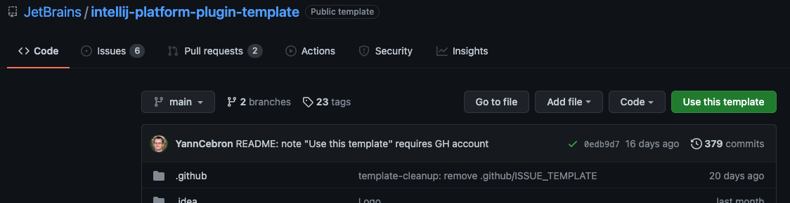
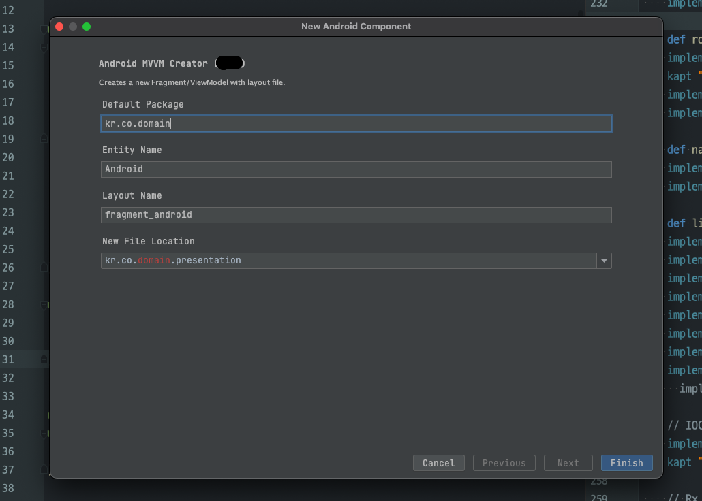
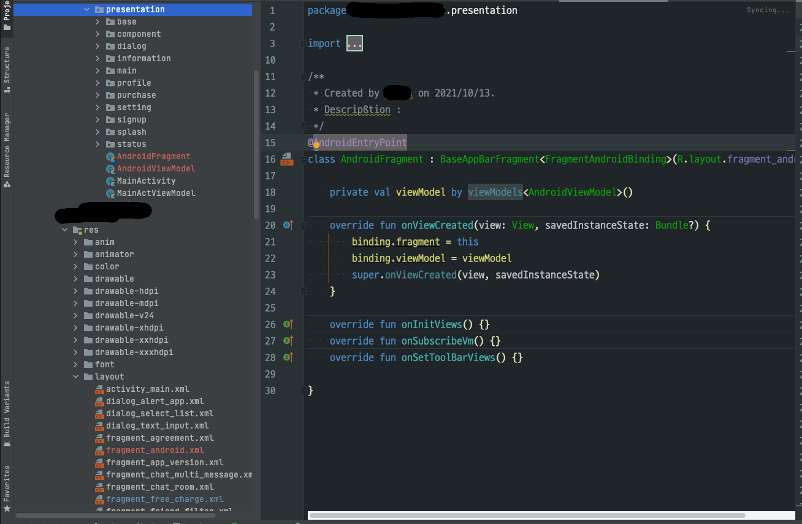

# android-mvvm-devoks-plugin
---

안드로이드 스튜디오(203.7717.56)용 파일 추가 탬플릿 플러그인 개발환경 구축 가이드

### Project Guide

1. 프로젝트 환경 준비

    1. Use This Template - [IntelliJ Platform Plugin Tempalte in Github](https://github.com/JetBrains/intellij-platform-plugin-template#plugin-template-structure)

    

    1. Clone from Github My Repository in Android Studio

    

2. 안드로이드용 커스텀 템플릿 플러그인 설정
    1. gradle.properties

        ```scheme
        # IntelliJ Platform Artifacts Repositories
        # -> https://plugins.jetbrains.com/docs/intellij/intellij-artifacts.html

        pluginGroup = com.github.ridsync.androidmvvmtemplate
        pluginName = android-mvvm-devoks-plugin  # 플러그인 명
        pluginVersion = 0.7.0 # 플러그인 버젼

        # See https://plugins.jetbrains.com/docs/intellij/build-number-ranges.html
        # for insight into build numbers and IntelliJ Platform versions.
        pluginSinceBuild = 203
        pluginUntilBuild = 212.*

        # Plugin Verifier integration -> https://github.com/JetBrains/gradle-intellij-plugin#plugin-verifier-dsl
        # See https://jb.gg/intellij-platform-builds-list for available build versions.
        pluginVerifierIdeVersions = 2020.3.4, 2021.1.3, 2021.2.1

        platformType = IC # 플랫폼 유형(커뮤니티,Ultimate,PhpStorm등의 타입선언)
        platformVersion = 2020.3.4  # IDE 플랫폼 버젼 (중요)
        platformDownloadSources = false

        # Plugin Dependencies -> https://plugins.jetbrains.com/docs/intellij/plugin-dependencies.html
        # Example: platformPlugins = com.intellij.java, com.jetbrains.php:203.4449.22
        platformPlugins = android, org.jetbrains.android, org.jetbrains.kotlin, java, com.intellij.java

        # Java language level used to compile sources and to generate the files for - Java 11 is required since 2020.3
        javaVersion = 11

        gradleVersion = 7.2

        # Opt-out flag for bundling Kotlin standard library.
        # See https://plugins.jetbrains.com/docs/intellij/kotlin.html#kotlin-standard-library for details.
        # suppress inspection "UnusedProperty"
        kotlin.stdlib.default.dependency = false

        # 스튜디오 설치 경로 속성(in Mac)
        StudioCompilePath = /Applications/Android Studio.app/Contents
        StudioRunPath = /Applications/Android Studio.app/Contents
        ```

    2. build.gradle.kts (기본 옵션에 추가된 빌드설정 요약.)

        ```scheme
        intellij {
            ```
        		// localPath 설정 (안드로이드 스튜디오 경로)
            localPath.set(properties("StudioRunPath"))
        }

        tasks {
          ```
        	instrumentCode {
                compilerVersion.set("203.7717.56") // 현재 사용중인 Android Studio Version
            }
        }

        ```
        // 기타 patch, Signing, Publishing등의 옵션
        ```

    3. src/main/resource/META-INF/plugin.xml

        ```scheme
        <!-- Plugin Configuration File. Read more: https://plugins.jetbrains.com/docs/intellij/plugin-configuration-file.html -->
        <idea-plugin>
            <id>androidmvvmtemplate</id>
            <name>android-mvvm-plugin-template</name>
            <vendor>ridsync</vendor>

            <depends>org.jetbrains.android</depends>
            <depends>com.intellij.modules.androidstudio</depends>

            <extensions defaultExtensionNs="com.android.tools.idea.wizard.template">
                <wizardTemplateProvider implementation="com.github.ridsync.wizard.WizardTemplateProviderImpl" />
            </extensions>
        <!-- 아래 클래스들은 불필요해서 주석처리 함 (미사용) -->
        <!--    <extensions defaultExtensionNs="com.intellij">-->
        <!--        <applicationService serviceImplementation="com.github.ridsync.androidmvvmtemplate.services.MyApplicationService"/>-->
        <!--        <projectService serviceImplementation="com.github.ridsync.androidmvvmtemplate.services.MyProjectService"/>-->
        <!--    </extensions>-->

        <!--    <applicationListeners>-->
        <!--        <listener class="com.github.ridsync.androidmvvmtemplate.listeners.MyProjectManagerListener"-->
        <!--            topic="com.intellij.openapi.project.ProjectManagerListener"/>-->
        <!--    </applicationListeners>-->

        </idea-plugin>
        ```

    4. src/main/kotlin/.../WizardTemplateProviderImpl.kt

        ```scheme
        class WizardTemplateProviderImpl  : WizardTemplateProvider() {
        		// 템플릿 프로바이더 구현 클래스 - 직접 커스텀한 템플릿(mvvmWizardTemplate.Class)를 생성 및 반환하는 역할
            override fun getTemplates(): List<Template> = listOf(mvvmWizardTemplate)
        }
        ```

    5. src/main/kotlin/.../mvvmWizardTemplate.kt

        ```scheme
        // TemplateBuilder를 통해 실제 Custom Template의 UI,위젯,파일처리등을 정의하는 클래스

        name = "Android MVVM Creator (DTK2)"
        description = "Creates a new Fragment/ViewModel with layout file."
        minApi = MIN_SDK
        category = Category.Other // Check other categories
        formFactor = FormFactor.Mobile
        ```

    6. src/main/kotlin/.../mvvmWizardRecipe.kt

        ```scheme
        // 파람을 통해 전달받은 ModuleTemplateData의 File정보로
        // 최종 생성할 파일의 저장위치,파일명등을 정의 및 생성처리하는 클래스

        val (projectData, srcOut, resOut) = moduleData

            addAllKotlinDependencies(moduleData)
            val format = SimpleDateFormat("yyyy/MM/dd")
            val date = format.format(Date())

            val path = srcOut.absolutePath.replace("java","kotlin") // 내 프로젝트에서는 kotlin dir을 사용하므로 replace처리 함.
            val srcKotlinDir = File(path)
            // Fragment Template String Save
            save(
                someFragment(date, defaultPackage, newFilePackage, entityName, layoutName, projectData),
                srcKotlinDir.resolve("${entityName}Fragment.kt")
            )
            // ViewModel Template String Save
            save(someFragmentViewModel(date, defaultPackage, newFilePackage, entityName, layoutName, projectData),
                srcKotlinDir.resolve("${entityName}ViewModel.kt"))
            // Layout(XML) Template String Save
            save(someFragmentLayout(defaultPackage, newFilePackage, entityName),
                resOut.resolve("layout/$layoutName.xml")
            )
        ```

    7. src/main/kotlin/.../FragmentAndLayout.kt

        ```scheme
        // 실제 생성할 파일들의 코드(String)를 생성하는 각 메소드
        fun someFragment(
                date: String,
                defaultPackage: String,
                newFilePackage: String,
                entityName: String,
                layoutName: String,
                projectData: ProjectTemplateData
        ): String {
                val databindingName = "Fragment${entityName.toLowerCase().toCamelCase()}Binding"
                return """package $newFilePackage

        import android.os.Bundle
        import android.view.View
        import androidx.fragment.app.viewModels
        import dagger.hilt.android.AndroidEntryPoint
        import ${defaultPackage}.presentation.base.BaseAppBarFragment
        import ${defaultPackage}.databinding.${databindingName}
        import ${defaultPackage}.R

        /**
         * Created by user on ${date}.
         * Description :
         */
        @AndroidEntryPoint
        class ${entityName}Fragment : BaseAppBarFragment<${databindingName}>(R.layout.${layoutName.toLowerCase()}) {

            private val viewModel by viewModels<${entityName}ViewModel>()

            override fun onViewCreated(view: View, savedInstanceState: Bundle?) {
                binding.fragment = this
                binding.viewModel = viewModel
                super.onViewCreated(view, savedInstanceState)
            }

            override fun onInitViews() {}
            override fun onSubscribeVm() {}
            override fun onSetToolBarViews() {}

        }

        """
        }
        ```

3. 빌드 및 테스트
    - IDE를 직접 디버깅상태로 직접 띄워서 플로그인의 기능 및 UI를 테스트할 수 있다.

    

4. 플러그인 설치 (jar)
    - 빌드 하면 /buil/lib 폴더에 'android-mvvm-devoks-plugin-0.7.0.jar' 파일 생성 됨
    - Android Studio에서 Preferences > Plugins > Install Plugin from Disk...를 선택
    - 빌드하여 생성된 jar 파일을 선택하여 설치 완료.

    

5. 플러그인 사용
    1. File > New > Other > Android MVVM Creator 를 선택
    2. Package는 자동완성 , EntitiyName을 작성하고,File Location을 선택
    3. Finish 버튼 선택하면 파일 생성 완료.





### Reference

---

[https://plugins.jetbrains.com/docs/intellij/welcome.html](https://plugins.jetbrains.com/docs/intellij/welcome.html)

[https://github.com/JetBrains/gradle-intellij-plugin](https://github.com/JetBrains/gradle-intellij-plugin)

[https://steewsc.medium.com/template-plugin-for-android-studio-4-1-92dcbc689d39](https://steewsc.medium.com/template-plugin-for-android-studio-4-1-92dcbc689d39)
---
Plugin based on the [IntelliJ Platform Plugin Template][template].

[template]: https://github.com/JetBrains/intellij-platform-plugin-template
